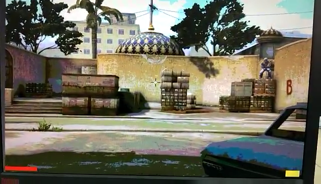
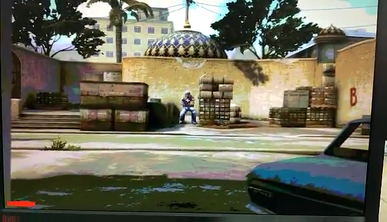
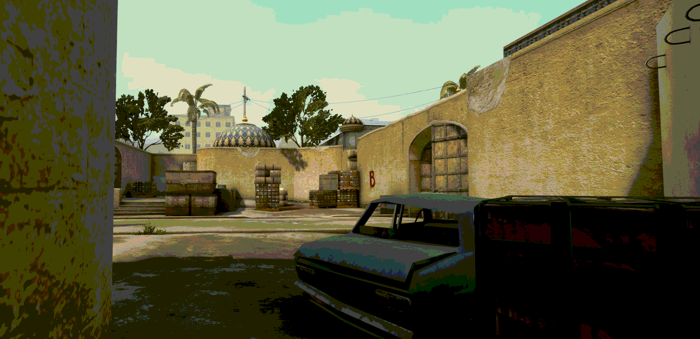

[下载展示视频](video.mp4)

# Counter-Strike: Global Offensive FPGA version

——数字电路实验大作业报告

本次实验我使用Nexys2开发板制作了一个类似于《反恐精英》的第一人称射击游戏。将开发板连接上显示器和鼠标后，玩家可以在屏幕上看到一张静态背景图片，移动鼠标瞄准随机出现的敌人并射击。屏幕上亦显示了生命值和子弹数量。

 

 

接下来我将分别介绍实现的各方面细节。

## 平台与外设

本实验使用的核心工具是Nexys2开发板，用ISE环境编写程序，Adept工具进行连接。

本实验使用了开发板上的数码管来显示得分、LED来显示子弹数量、按钮来重置游戏、开关来开启作弊模式。另外，还使用VGA接口连接了一台显示器，使用PS/2接口连接了一个鼠标。

## VGA接口时序

Nexys2开发板上有一个VGA接口，可以用来连接显示器，程序需输出水平同步信号、垂直同步信号和八位颜色总线。

VGA接口采用逐行扫描的方式工作，行与行之间水平同步信号应拉低一定时间，其他时候为高电平，帧与帧之间垂直同步信号应拉低一定时间，其他时候为高电平。在扫描屏幕上像素时，颜色总线上应传送当前像素颜色，其他时候为低电平。在Nexys2开发板上，颜色总线有8位，其中红色和绿色通道各3位，蓝色通道2位，实现了256色显示。开发板带有数模转换功能，会将8位数字信号转换为符合VGA接口需要的3个模拟信号。

在本次实验中，助教为我们编写了一份VGA接口的示例代码，在参考其代码及反复测试后，我重构实现了一个更简洁的VGA模块，并用它处理游戏显示。具体代码及注释收录于附录1。

## PS/2接口时序

Nexys2开发板上有一个PS/2接口，可以用来连接鼠标，程序要接受时钟信号和数据信号。

PS/2接口采用外部设备提供时钟信号，并在下降沿时数据可用的方式工作。传输数据时时钟信号频率在数十kHz左右，其他时间时钟信号保持高电平。数据以字节为单位，按特定格式封包后发送。

我查询Nexys2文档得知，PS/2接口的鼠标会在每次有事件时发送3个字节的数据，第一个字节包含当前鼠标键的状态，后两个字节分别是横向和纵向的移动量。但实际上这是错误的，现代鼠标会发送4个字节的数据，其最后一个字节为鼠标滚轮的滚动量。因为接口本身并没有规定一种判断数据结尾的方式，在获取了3个字节后无法判断是否还会有第四个字节到来，我选择以“PS/2的时钟信号一段时间没有变成过低电平”作为一次数据发送结束的标志，事实证明这是很正确的兼容不同鼠标的做法。

在编写相关代码时还遇到了另一个困难，至今也没有完全研究清楚其原因。我使用了一段代码来检测PS/2的时钟信号是否已经有一段时间一直维持在高电平，如果是的话，就判定现在PS/2接口处于空闲状态，随时可以接受下一个新的数据包。这段程序显然应该具有这样的特点：如果“空闲状态”刚刚解除（变为0），那么至少也要等一段时间后才有可能恢复为1。但是实践中发现电路的表现不符合这个预期，我认为是由于PS/2的时钟信号的变化没有和FPGA开发板上的时钟信号相同步所导致的，故另设了一个触发器，在FPGA开发板时钟上升沿对PS/2的时钟信号进行采样，将结果存入这个触发器，并把它当作PS/2时钟信号来对待。这个解决方案成功地消除了灵异事件。为了直观地展示出这个不符合逻辑的现象确实存在，我制作了一个最小化工程，用20行代码即可观察到问题，这个工程和相关解释收录在附录2中。

完成的PS/2鼠标接口代码和注释收录在附录3中。

## Flash ROM接口时序

简单计算可得，一屏640 x 480的256色画面包含约300KB的信息量。在本次实验中，为了让鼠标可以比较自由地移动，我使用的背景图片是1597 x 775的大小。这样的一张图片包含约1.2MB的信息量，远超出IP核ROM所允许的16KiB容量限制。解决方法有二：一是采用压缩算法将压缩后的图像放入IP核，二是使用Nexys2开发板上的容量为16MiB的Flash存储器。由于在FPGA上实现图像解压并不容易，我选择了后者。

查询Nexys2文档得知，开发板上有两个大容量存储器，分别是RAM和Flash。前者有易失性，而且本身已被用于存储电路连接关系（ .bit文件）本身，因此合适的选择是Flash存储器。这两个存储器共用一套地址总线和数据总线，要将Flash作为ROM使用，只需将4个信号设置为常数（存储器输出使能设为有效，存储器写使能设为无效，Flash复位设为无效，Flash片选设为有效），在24位地址总线上发送地址信号，即可在16位数据总线上读出两个字节的数据。值得一提的是，由于一次可以读出两个字节，所以地址必须为偶数，因此地址总线的最低有效位必须为0，这条线可以省略，实际上只有23条地址线。

此处的程序和项目主体关系密切，因此不另设模块，直接写在了顶层模块中。由于在地址总线上改变地址后，数据总线将会经历一段时间的不确定态才能得到数据，为了稳定持续地输出图像，我设了一个16位触发器。最终程序逻辑为：开始显示第2n-2列时，发出读取第2n和第2n+1列像素的请求。开始显示第2n列时，将数据总线的值存入触发器，同时发出读取第2n+2和第2n+3列像素的请求，以此类推。显示第2n列时，当前像素颜色等于触发器的高字节；显示第2n+1列时，当前像素颜色等于触发器的低字节。

## 关于设计框图和知识点的说明

由于本实验主要难点就在于上述接口处理，游戏逻辑无非是数学运算构成的，它们虽然也有复杂之处，但远不及接口时序复杂，故不再详述框架和具体用到的知识点。

## 图片素材处理

假设我们有一张尺寸为width x height的图片，在640 x 480的屏幕上显示时，为了保证全屏都被图片覆盖，而准星永远在屏幕中央，准星的移动范围大小其实是 (width-640) x (height-480)。在图片的四周，存在一个准星无法到达的区域，一张合适的背景图片应当使得敌人出现的位置分布在准星能到达的区域内。我选择了《反恐精英：全球攻势》中非常经典的“炙热沙城II”地图B点，从游戏中截取了一张1597 x 775大小的画面，符合上述要求。下图中的两个矩形框标出了玩家瞄准最左侧和最右侧的敌人时的显示范围：

 

为了将这张画面（background.png）转换为256色质量，我使用Python编程语言的PIL图像处理库对每个像素的颜色进行了处理，红色和绿色通道只保留最高3位，蓝色通道只保留最高2位。转换后的图片色块现象看起来较为明显，为了使墙面、地面等平面颜色较为均匀统一，我又使用画图工具进行了一些手工调整，得到了最终背景图（background.bmp）：

 

接下来就是添加敌人了。在这里我借鉴了特技电影拍摄时的“蓝幕”技术，即因为正蓝色在一般图片中很少出现，所以用它表示透明色。在游戏中截取了两个“恐怖分子”的图像后，我用画图工具将人物以外的地方涂蓝，得到了两个敌人（enemy1和enemy2）：


 

将这两个敌人添加到背景图片后，我制作了4张包含敌人的背景图片（background.[1~4].bmp）。至此，图片制作的工作结束。

为了方便程序读取，我通过在图片右侧和下侧添加黑色区域的方式，将图片宽度从1597扩充到2048， 高度从775扩充到1024。这样一来，24位内存地址就可以切分成若干部分，来表示要读取的像素了：

`FFFY YYYY YYYY YXXX XXXX XXXX`

从地址设计可以看出，现在我能够存储最多8张图片（F值），指定F值、X和Y即可读出特定图片的特定像素值。我只用到了F=0和F=1两张图片：F=0是背景图，F=1是4个敌人都在各自位置上时的背景图。后者是将4张各包含1个敌人的背景图合在一起产生的，这个合并的过程以及产生最终Flash ROM内容的过程都由一个Python程序实现，它和注释被收录在附录4中。

这个程序产生了background.bit，该二进制文件可以用Adept工具写入Flash存储器。连接Nexys2开发板后，在Adept中选择Memory标签页，选择“Flash”，在“Wirte data file to memory”中选择文件并点击Write即可。

## 游戏逻辑

首先，设x和y两组触发器保存当前瞄准的位置，当玩家移动鼠标时就改变它们。它们只能在一个范围内变化，在边界上继续向外移动是无效的。

其次，在玩家按下鼠标左键时，要检查各条件（下述）以确定当前能否射出子弹，如果这是一次成功的射击，需要做以下事情：

- 枪口上扬一小段距离，通过临时减少y实现（在停止射击后逐渐恢复）；
- 接下来一小段时间内不能射击（射速约为每秒12发）；
- 子弹数量减少一颗，如果子弹用完了，接下来2秒多时间因装填弹药而不能射击（装填弹药结束后子弹数量变满）；
- 如果准星指着敌人的位置，该位置的敌人被清除；
- 如果确实击杀了一名敌人，分数增加一分。

关于敌人的出生，每隔较长的一段时间，将随机的一名敌人设置为存在。我采用的随机算法是这样的：`x的最低位`和`生命值的最低位`异或结果决定了这个敌人是前两个之一还是后两个之一，`y的最低位`和`子弹数量的最低位`异或结果决定了这个敌人是上述两个中的哪一个。由于正常玩游戏时玩家肯定会不断移动鼠标位置，也会不断被命中而损失生命值、不断开枪而改变子弹数量，这个算法可以保证敌人的出生是难以预料的。

关于敌人对玩家造成的伤害，每隔很短的一段时间，就把玩家的生命值扣除掉一部分。扣除量正比于当前存在的敌人数量。

关于游戏画面显示，游戏画面由多个层次依次叠加而成，每一层次都使用蓝色表示透明。各个层次依次为：

1. 结束画面：正常游戏时为全透明，死亡后为全红；
2. 准星：屏幕中央的一个小白色十字，外侧有黑色延长线以增强辨识度；
3. 生命值显示：屏幕左下角的一个红色细条，宽度正比于生命值；
4. 子弹数量显示：屏幕右下角的一个黄色粗条，高度正比于子弹数量；
5. 背景画面：按照各位置是否有敌人，从F=0或F=1的图片中加载出正确部分拼接而成。

最后，为了方便测试，我设计了一个作弊开关。如果这个开关被打开，则生命值不会下降，游戏不会结束。

## 运行效果

最终运行效果如第一页图片和[展示视频](video.mp4)，玩家可以移动鼠标来控制屏幕上的准星，准星本身不会移动，但背景会移动。每隔一段时间会在随机位置自动出现敌人，对玩家造成伤害，必须快速射击使其消失。如果连续射击，枪口会因后坐力而不断上扬。如果射空子弹，则需要等待较长时间才能更换弹匣完毕。当生命值减少到零时全屏变红，表示游戏结束，按下按钮可重新开始。如果作弊开关被打开，则生命值不会下降。

我另外进行了游戏难度的测试，发现经过练习后一般人都能达到20分，而30分则很难达到。

## 感悟与收获

经过这次实验，我进一步熟悉了用Verilog语言进行FPGA开发的过程，学习了VGA、PS/2接口时序，体验了从构思、设计到一步步实现出来一个游戏的过程，很有成就感。我最大的感触就是硬件编程和软件编程确实有很奇妙的区别，许多时候能带领我使用与以往完全不同的思维方式看待问题（如：实例化多个计数器模块，它们之间完全并行并且不会相互干扰，借此可以非常方便地实现不同模块中需要的不同频率的信号）。

另外，在这次实验中我也遇到了一些非常棘手的问题，如处理PS/2接口时发现的Verilog奇异之处（见附录2），在自行调试、分析问题的过程中，我的调试能力得到了提高，工科思维能力得到了增强，这也是很大的收获。

## 附录1：VGA接口模块
```Verilog
// 16位计数器
module counter16(
	input clk,             // 时钟
	input rst,             // 复位
	input [15:0]range,     // 计数范围
	output reg [15:0]value // 当前计数值
);
	always@(posedge clk or posedge rst) begin
		if(rst) value <= 0;
		else if(value == range - 1) value <= 0;
		else value <= value + 1;
	end
endmodule

// VGA接口模块
module vga(
	input clk,            // 50MHz时钟
	input rst,            // 复位
	output vgaclk,        // VGA信号时钟
	output [8:0]row,      // 当前行数
	output [9:0]column,   // 当前列数
	input [7:0]color,     // 当前颜色（BBGGGRR）
	output [2:0]vgaRed,   // VGA红色通道
	output [2:0]vgaGreen, // VGA绿色通道
	output [1:0]vgaBlue,  // VGA蓝色通道
	output vgaHsync,      // VGA水平同步
	output vgaVsync       // VGA垂直同步
);
	// 时序
	parameter CLKF = 25;      // 时钟频率（25或50）
	parameter H_SYNC = 96;    // 行同步信号（vgaclk周期数）
	parameter H_BEGIN = 144;  // 行数据起始点
	parameter H_END = 784;    // 行数据结束点+1
	parameter H_PERIOD = 800; // 行长度
	parameter V_SYNC = 2;     // 场同步信号（行数）
	parameter V_BEGIN = 31;   // 场数据起始行
	parameter V_END = 511;    // 场数据结束行+1
	parameter V_PERIOD = 521; // 场行数

	wire clk25;
	counter16 clk25c(clk, rst, 2, clk25);
	assign vgaclk = (CLKF == 50) ? clk : clk25;

	wire [9:0]hcount;
	counter16 hc(vgaclk, rst, H_PERIOD, hcount);
	assign vgaHsync = (hcount < H_SYNC) ? 0 : 1;
	assign column = hcount - H_BEGIN;

	wire [9:0]vcount;
	counter16 vc(~(hcount[9]), rst, V_PERIOD, vcount);
	assign vgaVsync = (vcount < V_SYNC) ? 0 : 1;
	assign row = vcount - V_BEGIN;

	wire de;
	assign de = (vcount >= V_BEGIN) && (vcount < V_END) && (hcount >= H_BEGIN) && (hcount < H_END);
	assign vgaRed = de ? color[2:0] : 0;
	assign vgaGreen = de ? color[5:3] : 0;
	assign vgaBlue = de ? color[7:6] : 0;
endmodule
```

## 附录2：Verilog怪异行为展示

使用Nexys2开发板并为其连接一个PS/2接口鼠标，编译以下 .ucf文件和 .v文件组成的项目并运行，即可看出问题：从代码来分析，led无论如何也不可能快速闪烁，但事实上如果随意乱动鼠标，它确实会快速闪烁。

( .ucf file )
```Verilog
NET "clk"  LOC = "B8";
NET "led"  LOC = "J14";
NET "PS2C" LOC = "R12";
```
( .v file )
```Verilog
`timescale 1ns / 1ps
module top(
	input clk,
	input PS2C,
	output led
);
	reg [25:0]idlec;
	always@(posedge clk) begin
		if(~PS2C)      idlec <= 1;
		else if(idlec != 0) idlec <= idlec + 1;
	end
	assign led = (idlec == 0);
endmodule
```

如果用这个 .v文件，则问题得到解决，电路表现将会符合预期：

```Verilog
`timescale 1ns / 1ps
module top(
	input clk,
	input PS2C,
	output led
);
	reg ps2c;
	always@(posedge clk) ps2c <= PS2C;
	reg [25:0]idlec;
	always@(posedge clk) begin
		if(~ps2c)      idlec <= 1;
		else if(idlec != 0) idlec <= idlec + 1;
	end
	assign led = (idlec == 0);
endmodule
```

## 附录3：PS/2鼠标接口模块

```Verilog
module mouse(
	input clk,         // 板载时钟信号
	input rst,         // 复位信号
	input PS2C_act,    // PS/2时钟信号
	input PS2D,        // PS/2数据信号
	output reg [9:0]x, // X坐标
	output reg [7:0]y, // Y坐标
	output btnl,       // 鼠标左键
	output btnr        // 鼠标右键
);
	// 对时钟信号取样，否则不知为何无法正常工作
	reg PS2C;
	always@(posedge clk) PS2C <= PS2C_act;

	// 鼠标发来的4个字节
	reg [7:0]w1;
	reg [7:0]w2;
	reg [7:0]w3;
	reg [7:0]w4;
	reg [12:0]idlec;
	always@(posedge clk or posedge rst) begin
		if(rst) idlec <= 1;
		else if(~PS2C) idlec <= 1;
		else if(idlec != 0) idlec <= idlec + 1;
	end
	assign idle = (idlec == 0);

	// 时钟信号的旧值
	reg oldps2c;
	always@(posedge clk) begin
		oldps2c <= PS2C;
	end

	wire [9:0]newx;
	wire [9:0]newy;
	assign newx = x + {w2[7], w2[7], w2};
	assign newy = {2'b00, y} - {w3[7], w3[7], w3};

	reg [2:0]state;
	reg [8:0]step;
	always@(posedge clk or posedge rst) begin
		if(rst) begin
			w1 <= 0;
			w2 <= 0;
			w3 <= 0;
			w4 <= 0;
			x <= 349;
			y <= 114;
			state <= 7;
			step <= 0;
		end
		else if(idle && PS2C) state <= 0;
		else if(oldps2c & ~PS2C) case(state)
			0: if(~PS2D) begin
					state <= 1;
					step <= 0;
				end
			1: begin
				if(step[3] == 0) w1[step] <= PS2D;
				if(step == 10)	state <= 2;
				if(step == 10) step <= 0;
				else step <= step + 1;
			end
			2: begin
				if(step[3] == 0) w2[step] <= PS2D;
				if(step == 10)	state <= 3;
				if(step == 10) step <= 0;
				else step <= step + 1;
			end
			3: begin
				if(step[3] == 0) w3[step] <= PS2D;
				if(step == 10)	state <= 4;
				if(step == 10) step <= 0;
				else step <= step + 1;
			end
			4: begin
				if(step[3] == 0) w4[step] <= PS2D;
				if(step == 10)	state <= 5;
				if(step == 10) step <= 0;
				else step <= step + 1;
				if(step == 0) begin
					x <= newx > 861 ? 0 : newx > 698 ? 698 : newx;
					y <= (newy > 760) || (newy < 50) ? 50 : newy > 228 ? 228 : newy;
				end
			end
			5: begin
				state <= 6;
			end
			6: begin
				state <= 6;
			end
		endcase
	end

	assign btnl = w1[0];
	assign btnr = w1[1];

endmodule
```

## 附录4：生成Flash内容的脚本

```Python
#!/usr/bin/python3
# encoding=utf-8
from PIL import Image
# 4张带敌人的图片
imgs = [
Image.open('background.1.bmp'),
Image.open('background.2.bmp'),
Image.open('background.3.bmp'),
Image.open('background.4.bmp')]
width, height = imgs[0].size
# 最终二进制文件
f = open('background.bit', 'wb')
# 写F=0的图片，也就是没有敌人的背景图
for row in range(height):
    for column in range(width):
        if column < 450: img = imgs[1]
        else: img = imgs[0]
        red, green, blue = img.getpixel((column, row))
        f.write(bytearray(((red>>5) + ((green>>2)&0x38) + (blue&0xc0),)))
    # 用黑色填充为2048列
f.write(bytearray((0,)*(2048-width)))
# 用黑色填充为1024行
f.write(bytearray((0,)*((1<<21)-2048*height)))
# 写F=1的图片，也就是有4个敌人的图
for row in range(height):
    for column in range(width):
        if column < 450: img = imgs[0]
        elif column < 610: img = imgs[1]
        elif column < 730: img = imgs[2]
        else: img = imgs[3]
        red, green, blue = img.getpixel((column, row))
        f.write(bytearray(((red>>5) + ((green>>2)&0x38) + (blue&0xc0),)))
# 用黑色填充为2048列
f.write(bytearray((0,)*(2048-width)))
# 用黑色填充为1024行
f.write(bytearray((0,)*((1<<21)-2048*height)))
f.close()
```